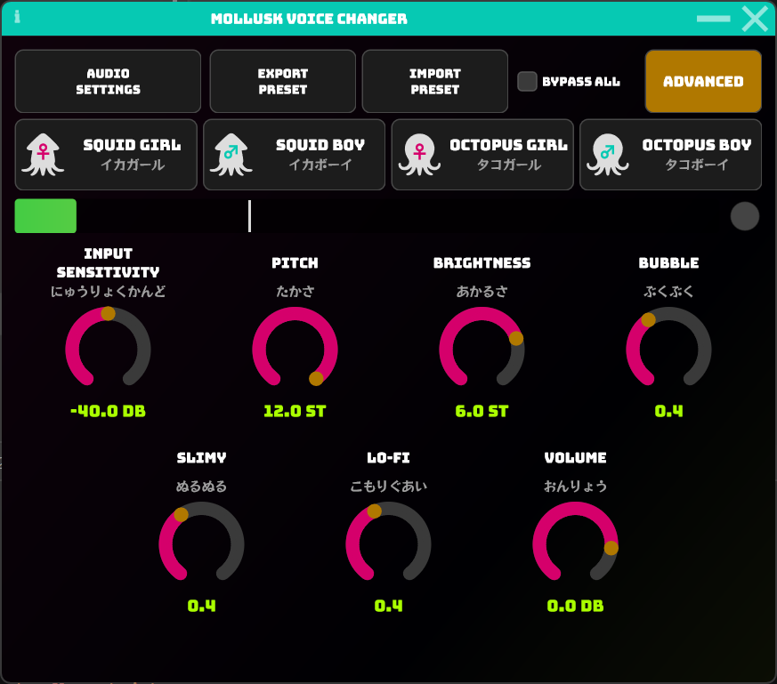
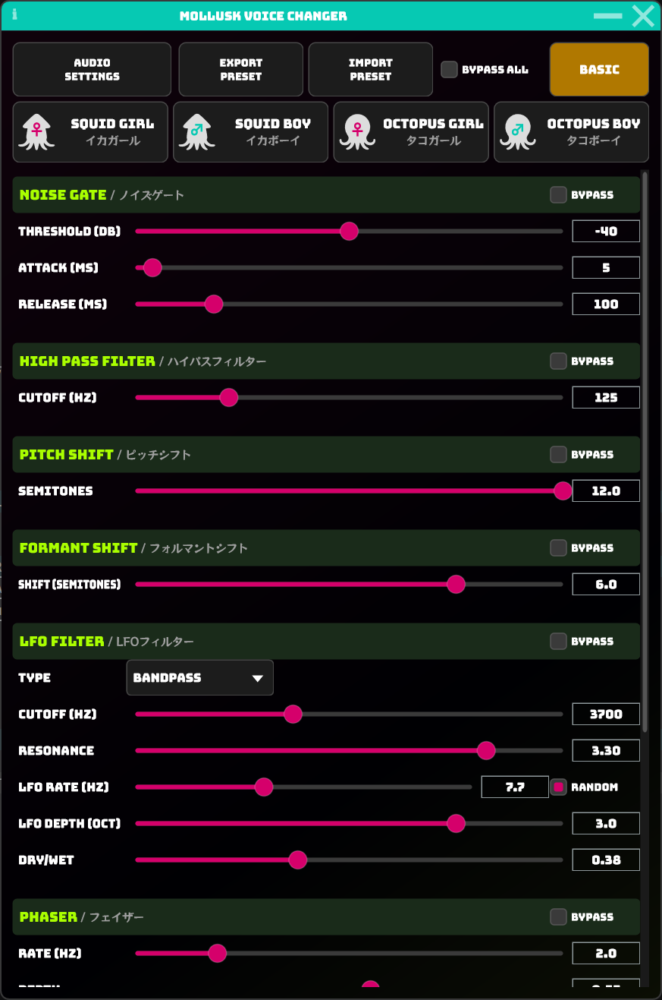

# Mollusk Voice Changer

声を軟体生物（イカ・タコ）風にリアルタイム加工する、通話・配信向けボイスチェンジャーです。

---

## スクリーンショット

| Basic モード | Advanced モード |
|:---:|:---:|
|  |  |

---

## 特徴

- **4種のプリセット** — Squid Girl / Squid Boy / Octopus Girl / Octopus Boy
- **Basic モード** — ロータリーノブで主要パラメータを直感的に操作
- **Advanced モード** — 各エフェクトを個別に細かく調整（縦スクロール対応）
- **DSP パイプライン**
  - Noise Gate → High Pass Filter → Pitch Shifter → Formant Shifter
  - LFO Filter → Phaser → Band Pass Filter → Output Gain
- **セッション保持** — 終了時に設定を自動保存し、次回起動時に復元
- **プリセット エクスポート / インポート** — XML 形式で設定を保存・共有

---

## 動作環境

| 項目 | 要件 |
|------|------|
| OS | Windows 10 / 11 |
| 仮想オーディオデバイス | [VB-CABLE](https://vb-audio.com/Cable/) |
| 通話/配信アプリ | 入力デバイスに VB-CABLE を設定 |

> macOS 向けビルドも対応していますが、動作確認は Windows のみです。

---

## ビルド方法

### 必要なもの

- CMake 3.22 以上
- Visual Studio 2022（Windows）または Xcode（macOS）
- Git

### 手順

```bash
# リポジトリをクローン
git clone https://github.com/hyakkei/MolluskVoiceChanger.git
cd MolluskVoiceChanger

# JUCE サブモジュールを取得
git submodule update --init --recursive

# ビルド（Windows）
cmake -B build
cmake --build build --config Release
```

ビルド成果物は `build/MolluskVoiceChanger_artefacts/Release/` に生成されます。

---

## セットアップ

1. **VB-CABLE** をインストールし、PCを再起動します。
2. アプリを起動し、**AUDIO SETTINGS** から以下を設定します。
   - 入力デバイス: マイク
   - 出力デバイス: CABLE Input (VB-Audio Virtual Cable)
3. 通話/配信アプリ の設定 入力デバイスを **CABLE Output** に変更します。

---

## 使い方

### Basic モード

| ノブ | 説明 |
|------|------|
| INPUT SENSITIVITY | ノイズゲートのしきい値 |
| PITCH | ピッチシフト量（半音単位） |
| BRIGHTNESS | フォルマントシフト量 |
| BUBBLE | LFO フィルターの Dry/Wet |
| SLIMY | フェイザーの Dry/Wet |
| LO-FI | バンドパスフィルターの Dry/Wet |
| VOLUME | 出力ゲイン |

### Advanced モード

各エフェクトセクションを個別に調整できます。BYPASS チェックボックスで各エフェクトを無効化可能です。

---

## 使用ライブラリ

- [JUCE](https://juce.com/) — © Raw Material Software Limited
- フォント (Google Fonts, SIL OFL):
  - [Bungee](https://fonts.google.com/specimen/Bungee)
  - [RocknRoll One](https://fonts.google.com/specimen/RocknRoll+One)
  - [Alfa Slab One](https://fonts.google.com/specimen/Alfa+Slab+One)
  - [Rubik Glitch](https://fonts.google.com/specimen/Rubik+Glitch)

---

## ライセンス

Copyright (C) 2026 Ito Hyakkei

本ソフトウェアは [GNU Affero General Public License v3.0](LICENSE) のもとで公開されています。
ソースコードの複製・改変・再配布は、同ライセンスの条件に従う限り自由に行えます。