# Mollusk Voice Changer — Windows 版 使い方ガイド

声を軟体生物（イカ・タコ）風にリアルタイム加工できる、通話・配信向けボイスチェンジャーです。


---

## 目次

1. [必要なもの](#1-必要なもの)
2. [STEP 1 — VB-CABLE のインストール](#step-1--vb-cable-のインストール)
3. [STEP 2 — Mollusk Voice Changer のインストール](#step-2--mollusk-voice-changer-のインストール)
4. [STEP 3 — AUDIO SETTINGS の設定](#step-3--audio-settings-の設定)
5. [STEP 4 — Discord で使う](#step-4--discord-で使う)
6. [STEP 5 — OBS で使う](#step-5--obs-で使う)
7. [画面の操作方法](#7-画面の操作方法)
8. [トラブルシューティング](#8-トラブルシューティング)

---

## 1. 必要なもの

| 項目 | 内容 |
|------|------|
| OS | Windows 10 / 11（64bit） |
| マイク | PC 内蔵マイクまたは外部マイク |
| ランタイム | **Microsoft Visual C++ 2022 再頒布可能パッケージ (x64)**（無料・多くの環境に導入済み） |
| 仮想オーディオデバイス | **VB-CABLE**（無料） |
| アプリ本体 | **Mollusk Voice Changer** |
| 通話/配信アプリ | Discord、OBS など |

> **仕組みの概要**
>
> ```
> マイク
>   ↓
> Mollusk Voice Changer（加工）
>   ↓
> VB-CABLE Input（仮想デバイスへ送信）
>   ↓
> VB-CABLE Output（仮想マイクとして出力）
>   ↓
> Discord / OBS（加工済みの声として認識）
> ```
>
> **VB-CABLE** は「仮想の音声ケーブル」です。  
> Mollusk Voice Changer が加工した声を VB-CABLE 経由で Discord や OBS に送ることで、相手には加工済みの声が届きます。

---

## STEP 1 — VB-CABLE のインストール

### 1-1. ダウンロード

VB-Audio 公式サイトからダウンロードします。

**URL:** https://vb-audio.com/Cable/

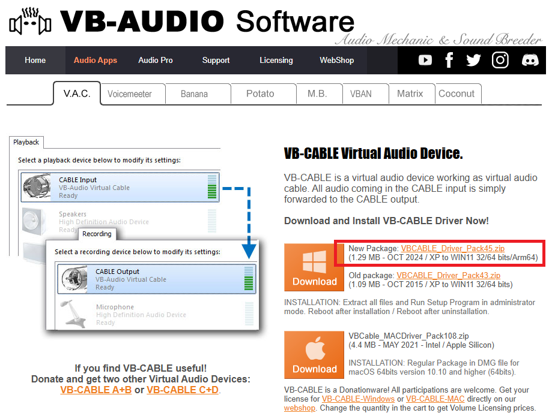

「Download: VB-Cable Driver Pack」ボタンをクリックして ZIP ファイルを保存します。

---

### 1-2. インストール

1. ダウンロードした ZIP を解凍します。

2. 解凍したフォルダ内の **`VBCABLE_Setup_x64.exe`** を **右クリック → 「管理者として実行」** します。

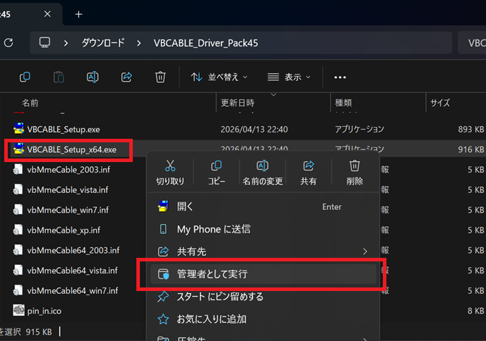

3. 「Install Driver」ボタンをクリックします。

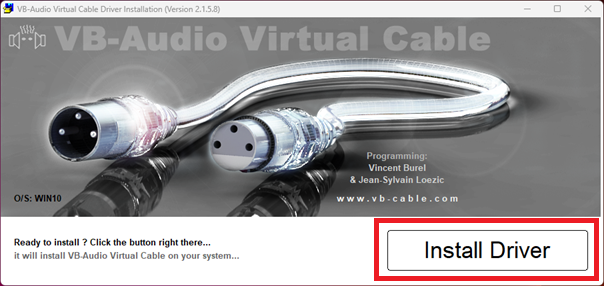

4. UAC（ユーザーアカウント制御）の確認ダイアログが出たら「はい」をクリックします。

5. インストール完了後、**PC を再起動**します。

> ⚠️ **再起動が必須です。** 再起動しないと VB-CABLE がデバイスとして認識されません。

---

### 1-3. インストール確認

再起動後、VB-CABLE が正しく認識されているか確認します。

1. タスクバーの音量アイコンを**右クリック** →「サウンドの設定を開く」をクリックします。

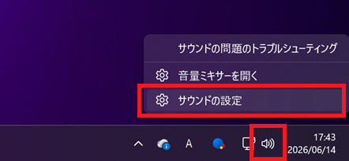

2. 「出力デバイスの選択」のプルダウンに **CABLE Input (VB-Audio Virtual Cable)** が表示されていれば OK です。

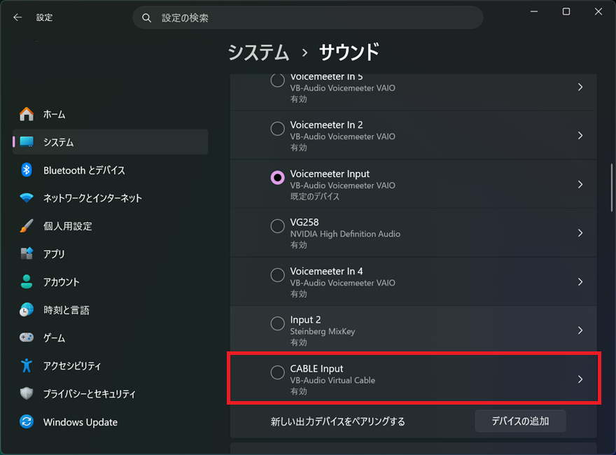

---

## STEP 2 — Mollusk Voice Changer のインストール

> **事前確認: Microsoft Visual C++ 2022 再頒布可能パッケージ**
>
> 本アプリは Visual Studio 2022 でビルドされており、実行に **Microsoft Visual C++ 2022 再頒布可能パッケージ (x64)** が必要です。  
> Windows 10 / 11 の多くの環境にはすでにインストールされていますが、クリーンインストール直後の環境では別途インストールが必要な場合があります。
>
> アプリ起動時に「vcruntime140.dll が見つかりません」などのエラーが出た場合は、Microsoft の公式サイトから **VC_redist.x64.exe** をダウンロードしてインストールしてください。  
> **URL:** https://aka.ms/vs/17/release/vc_redist.x64.exe

### 2-1. ダウンロード

配布ページから最新版の Windows インストーラーをダウンロードします。

ファイル名: **`MolluskVoiceChangerInstaller.exe`**

---

### 2-2. インストール

1. ダウンロードした **`MolluskVoiceChangerInstaller.exe`** をダブルクリックします。

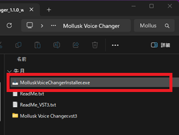

2. 画面の指示に従ってインストールを完了します。


3. インストール後、スタートメニューまたはデスクトップのショートカットから **Mollusk Voice Changer** を起動します。

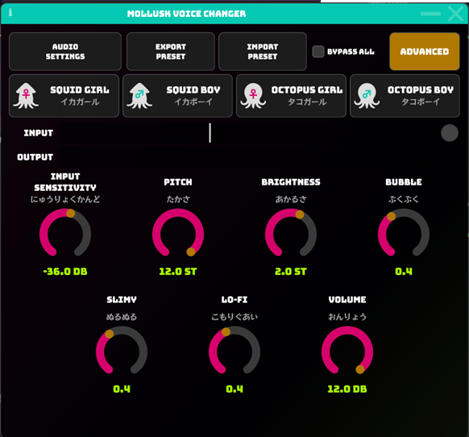

アプリが起動すれば STEP 2 は完了です。

---

## STEP 3 — AUDIO SETTINGS の設定

アプリを起動したら、最初に音声デバイスを設定します。

### 3-1. AUDIO SETTINGS を開く

画面左上の **「AUDIO SETTINGS」** ボタンをクリックします。

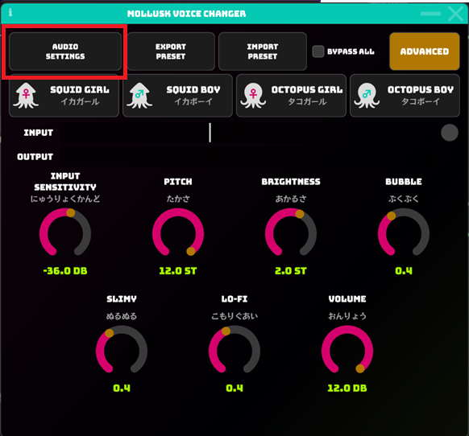

---

### 3-2. 入力・出力デバイスを設定する

AUDIO SETTINGS ダイアログで以下のように設定します。

| 項目 | 設定値 |
|------|--------|
| **入力デバイス（Input Device）** | お使いのマイク |
| **出力デバイス（Output Device）** | CABLE Input (VB-Audio Virtual Cable) |

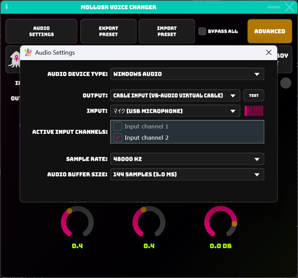

> **入力デバイス** = 実際のマイク（自分の声を拾う）  
> **出力デバイス** = VB-CABLE の「Input」側（加工した声を仮想ケーブルへ流す）

設定後、ダイアログを閉じます。

---

### 3-3. 動作確認

マイクに向かって話しかけ、画面の **INPUT** / **OUTPUT** レベルメーターが反応するか確認します。

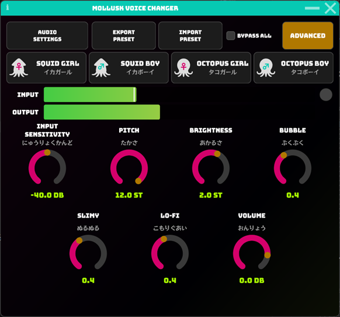

- **INPUT**（緑のバー）が動く → マイクが正しく認識されています
- **OUTPUT**（緑のバー）が動く → 加工済みの音声が VB-CABLE に送られています

---

## STEP 4 — Discord で使う

### 4-1. Discord の音声設定を開く

Discord を起動し、左下の**歯車アイコン（ユーザー設定）** をクリックします。

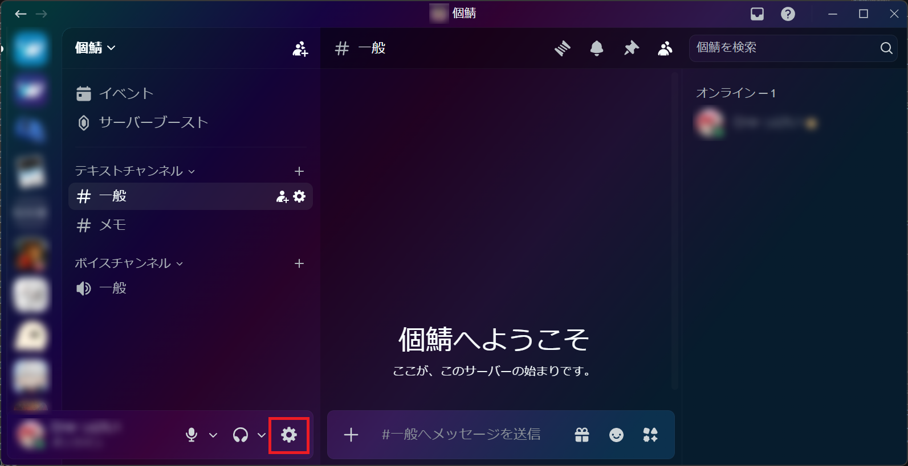

サイドバーの **「音声・ビデオ」** をクリックします。

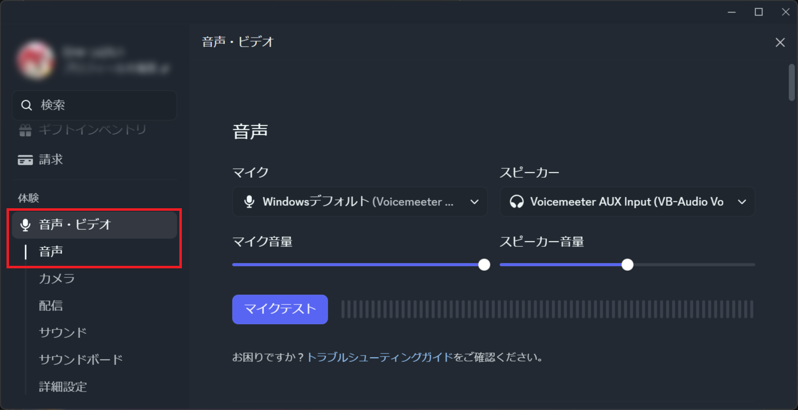

---

### 4-2. 入力デバイスを変更する

「入力デバイス」のプルダウンを **CABLE Output (VB-Audio Virtual Cable)** に変更します。

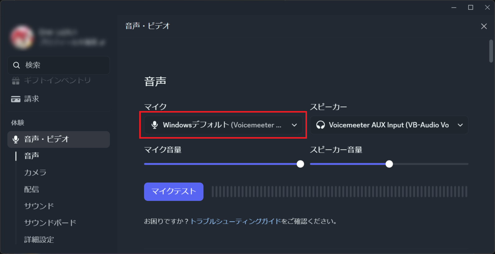
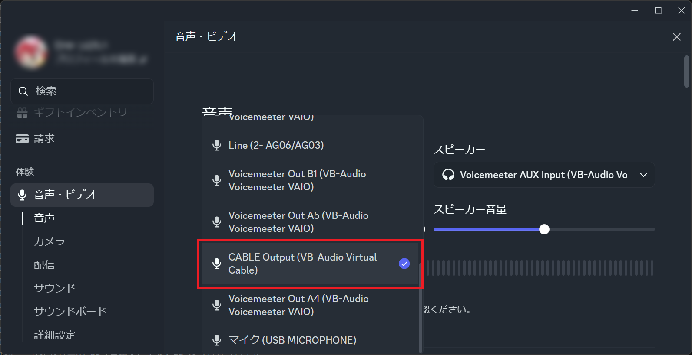

> **CABLE Output** = VB-CABLE から出てくる加工済みの声を Discord が受け取る

---

### 4-3. ノイズキャンセルをオフにする

> ⚠️ **重要:** Discord のノイズキャンセル機能が有効だと、加工された声を「ノイズ」と判断してカットしてしまう場合があります。

「入力感度」セクションの **「入力感度を自動調整する」** をオフにし、  
ノイズキャンセル（Krisp、RNNoise など）を **「オフ」または「なし」** に設定します。

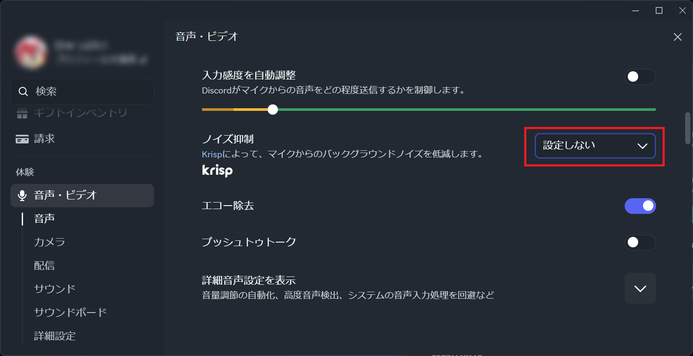


> 💡 **Tip:** 喋っていない時の環境ノイズが気になる場合は **Mollusk Voice Changer** の **INPUT SENSITIVITY(にゅうりょくかんど)** を調整してください。

---

### 4-4. 動作確認

通話を開始して相手に声が届くか確認します。声が加工されて届いていれば設定完了です。

---

## STEP 5 — OBS で使う

### 5-1. 音声入力キャプチャを追加する

OBS を起動し、**「ソース」** パネルの **「+」** ボタンをクリックします。

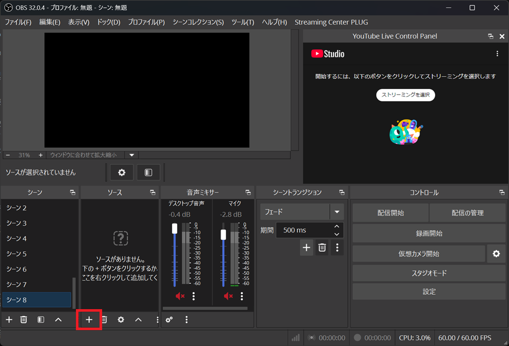

一覧から **「音声入力キャプチャ」** を選択します。

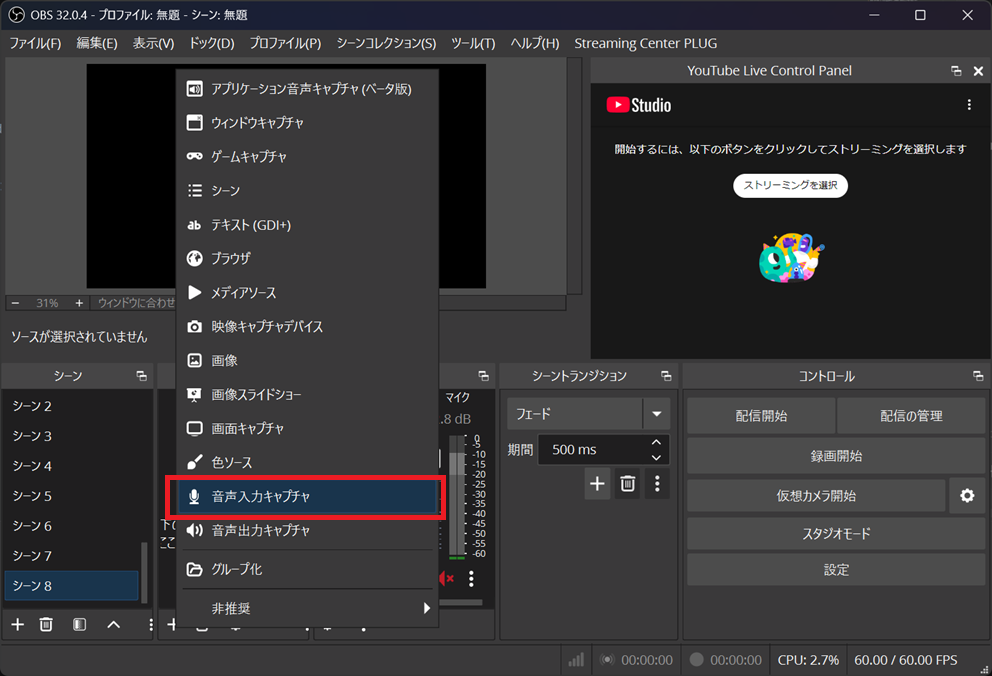

ソース名は任意（例: `Mollusk Voice Changer`）で入力し、「OK」をクリックします。

---

### 5-2. デバイスを設定する

プロパティダイアログが開くので、**「デバイス」** のプルダウンを **CABLE Output (VB-Audio Virtual Cable)** に変更し、「OK」をクリックします。

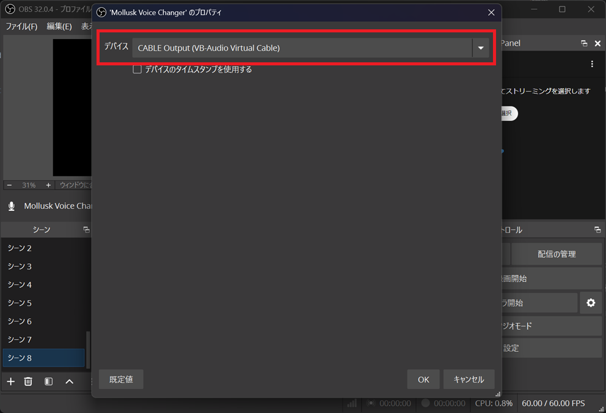

---

### 5-3. 音声ミキサーで確認する

OBS メイン画面下部の「音声ミキサー」に、追加したソース名のレベルメーターが表示されます。  
マイクに向かって話したときにメーターが動けば、加工済みの声が OBS に届いています。

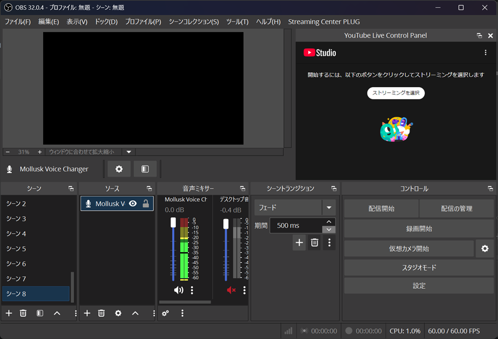

> **補足:** OBS で配信・録画を行うと、リスナーには加工された声が届きます。  
> 自分のモニタリング（返し）が必要な場合は、ミキサーの歯車アイコン →「音声の詳細プロパティ」から「モニターと出力」に設定してください。

---

## 7. 画面の操作方法

### Basic モード（デフォルト）

アプリ起動時は **Basic モード** が表示されます。


| ノブ | 説明 |
|------|------|
| **INPUT SENSITIVITY** | マイクの感度（ノイズゲートのしきい値）。小さい音を拾いたくない場合は右へ回す |
| **PITCH** | 声の高さ（半音単位）。正の値で高く、負の値で低くなる |
| **BRIGHTNESS** | 声の明るさ（フォルマントシフト）。正の値でイカっぽく、負でくぐもった印象に |
| **BUBBLE** | 声の揺らぎ（LFO フィルター）。値が大きいほどブクブク感が増す |
| **SLIMY** | ぬめり感（フェイザー）。値が大きいほどヌルヌルした音色になる |
| **LO-FI** | こもり感（バンドパスフィルター）。値が大きいほど水中感が増す |
| **VOLUME** | 出力音量 |

**ノブの操作方法**

- 左クリックしたままドラッグ（上下）で調整します
- ダブルクリックでデフォルト値にリセットされます

---

### プリセット

画面上部の 4 つのボタンからキャラクターを選択できます。

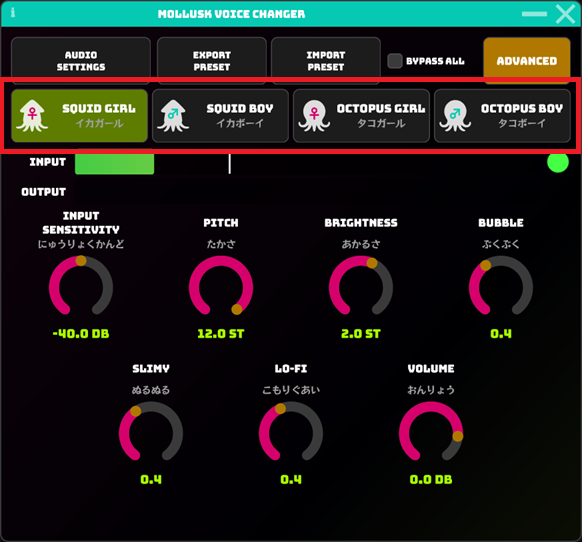

| プリセット | 特徴 |
|-----------|------|
| **Squid Girl（イカガール）** | 高めのピッチ・明るい音色 |
| **Squid Boy（イカボーイ）** | 中程度のピッチ・力強い音色 |
| **Octopus Girl（タコガール）** | 高めのピッチ・ふわっとした揺らぎのある音色 |
| **Octopus Boy（タコボーイ）** | 低めのピッチ・ダミ声 |

---

### Advanced モード

右上の **「ADVANCED」** ボタンをクリックすると、各エフェクトを個別に細かく調整できます。

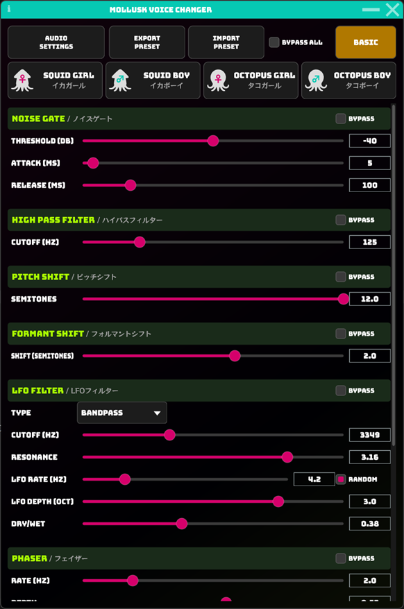

各セクション右上の **「BYPASS」** チェックボックスをオンにすると、そのエフェクトをスキップできます。  
上部の **「BYPASS ALL」** チェックボックスで全エフェクトを一括バイパスできます。

| セクション | 主なパラメータ |
|-----------|--------------|
| **NOISE GATE** | Threshold / Attack / Release |
| **HIGH PASS FILTER** | Cutoff (Hz) |
| **PITCH SHIFT** | Semitones（半音単位のピッチ） |
| **FORMANT SHIFT** | Shift（フォルマントシフト量） |
| **LFO FILTER** | Type / Cutoff / Resonance / Rate / Depth / Dry-Wet |
| **PHASER** | Rate / Depth / Feedback / Dry-Wet |
| **BAND PASS FILTER** | Cutoff / Bandwidth / Dry-Wet |
| **OUTPUT GAIN** | Gain (dB) |

---

### プリセットの保存・読み込み

現在の設定を XML ファイルとして保存・読み込みできます。

- **「EXPORT PRESET」** — 現在の設定をファイルに書き出す
- **「IMPORT PRESET」** — 保存済みの設定ファイルを読み込む

> アプリを終了すると設定は自動的に保存され、次回起動時に復元されます。

---

## 8. トラブルシューティング

### 声が Discord / OBS に届かない

**確認ポイント:**

1. Mollusk Voice Changer が起動しているか確認する
2. AUDIO SETTINGS の **出力デバイス** が `CABLE Input (VB-Audio Virtual Cable)` になっているか確認する
3. Discord / OBS の **入力デバイス** が `CABLE Output (VB-Audio Virtual Cable)` になっているか確認する
4. Mollusk Voice Changer の OUTPUT レベルメーターが動いているか確認する

---

### 声が加工されずにそのまま届く

**確認ポイント:**

- アプリ上部の **「BYPASS ALL」** チェックボックスがオフになっているか確認する
- PITCH と BRIGHTNESS が両方 0 の場合、FFT 処理がスキップされるため声が加工されません。いずれかのノブを少し動かしてみてください

---

### Discord 側で声がブツブツ切れる・消える

**原因:** Discord のノイズキャンセル機能が加工された声をノイズとして除去している可能性があります。

**対処法:** Discord の設定 → 音声・ビデオ → ノイズキャンセルを **「オフ」または「なし」** に設定してください（[STEP 4-3 参照](#4-3-ノイズキャンセルをオフにする)）。

---

### INPUT メーターが動かない（マイクが認識されない）

**対処法:**

1. AUDIO SETTINGS の **入力デバイス** が正しいマイクになっているか確認する
2. Windows の設定 → プライバシーとセキュリティ → **マイクへのアクセス** がオンになっているか確認する
3. マイクが物理的に接続されているか確認する

---

### アプリが起動しない（「vcruntime140.dll が見つかりません」などのエラー）

**原因:** Microsoft Visual C++ 2022 再頒布可能パッケージ (x64) が未インストールです。

**対処法:** 以下の URL から **VC_redist.x64.exe** をダウンロードしてインストールし、PC を再起動してください。

**URL:** https://aka.ms/vs/17/release/vc_redist.x64.exe

---

### VB-CABLE が選択肢に表示されない

**対処法:**

1. VB-CABLE のインストールが完了しているか確認する（[STEP 1-2 参照](#1-2-インストール)）
2. **PC を再起動**していない場合は再起動する
3. VB-CABLE の管理者権限でのインストールが必要な場合があります（`VBCABLE_Setup_x64.exe` を右クリック → 管理者として実行）

---

## 連絡先・フィードバック

- **Mail:** ito.7474@gmail.com
- **X (Twitter):** [@ito_74](https://x.com/ito_74)

---

*Mollusk Voice Changer v1.1.0 — © 2026 Ito Hyakkei*  
*本ソフトウェアは [GNU Affero General Public License v3.0](https://www.gnu.org/licenses/agpl-3.0.html) のもとで公開されています。*
